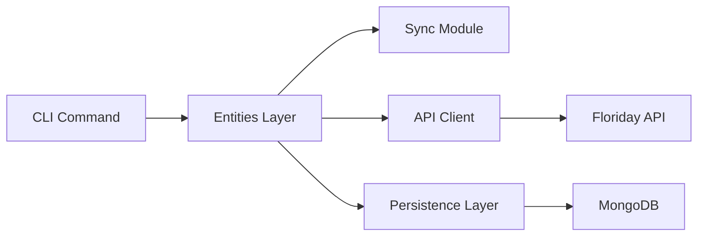

# Doing

## Goal

Add customer orders to the synced entities, following the existing patterns for entity synchronization.

## Analysis

The application currently syncs organizations, trade items, and supply lines using a consistent pattern:

1. Entity sync functions in entities.py
2. CLI commands in sync.py
3. Persistence through MongoDB

We'll follow this pattern to add customer orders synchronization.

## Design



## Steps

After each step, make sure there is a test for any changed functionality and commit our work.

Step 1: Core Entity Sync

- [x] Add tests in tests/test_entities.py for customer offers sync functionality
- [x] Add customer offers section in docs/cli_documentation.md
- [x] Add customer offers sync in src/floridayvine/floriday/entities.py

Step 2: CLI Integration

- [x] Add tests in tests/test_sync.py for CLI command
- [x] Update CHANGELOG.md with new feature
- [x] Add customer_offers command in src/floridayvine/commands/sync.py

Step 3: Integration Testing

- [x] Add integration test in tests/test_sync_customer_offers.py
- [x] Update persistence.py to include customer_offers in SYNC_COLLECTIONS
- [x] No need to update software architecture documentation as it already provides a general pattern

## Quality Assurance

Before considering this complete:

- [x] Run make quality for linting and formatting
- [x] Run make test for unit tests (tests/test_sync.py and tests/test_entities.py)
- [x] Run integration tests following CONTRIBUTING.md guidelines:
  1. Load the required credentials: `source scripts/load_credentials.sh`
  2. Verify connectivity: `floridayvine about` (this checks database and API connectivity)
  3. Run the tests: `make test-integration`
- [x] Manual verification of the sync functionality (verified through integration tests)

## Retrospective

The implementation of customer offers sync went smoothly by following the existing patterns in the codebase. Here's a reflection on the process:

### What Went Well

- Following the established pattern made it straightforward to add a new entity
- Test-driven development approach ensured functionality worked as expected
- The existing architecture documentation provided clear guidance
- Integration tests verified the end-to-end functionality

### Improvements for Next Time

- Consider automating more of the integration testing process
- Add a command to list customer offers similar to the existing inventory commands
- Update the database initialization script to automatically include new collections

### Guide for Adding a New Entity to Sync

Based on this implementation, here's a step-by-step guide for adding another entity:

1. **Core Entity Sync**
   - Add tests for the new entity sync functionality
   - Add the entity sync function in `src/floridayvine/floriday/entities.py`
   - Follow the pattern of existing sync functions:

     ```python
     def sync_new_entity(start_seq_number=None, limit_result=50):
         api = NewEntityApi(get_api_client())
         
         def persist_entity(entity):
             persist("new_entity", entity.entity_id, entity.to_dict())
             return entity.name_or_id
         
         return sync_entities(
             "new_entity",
             api.get_new_entity_by_sequence_number,
             persist_entity,
             start_seq_number,
             limit_result,
         )
     ```

2. **CLI Integration**
   - Add tests for the CLI command
   - Add the command in `src/floridayvine/commands/sync.py`
   - Update CLI documentation

3. **Database Integration**
   - Add the entity to `SYNC_COLLECTIONS` in `src/floridayvine/persistence.py`
   - This ensures the collection is created during database initialization

4. **Integration Testing**
   - Add integration tests for the new entity
   - Verify end-to-end functionality

5. **Documentation**
   - Update CHANGELOG.md with the new feature
   - Update any relevant documentation

This guide should make it easier to add new entities in the future while maintaining consistency across the codebase.
