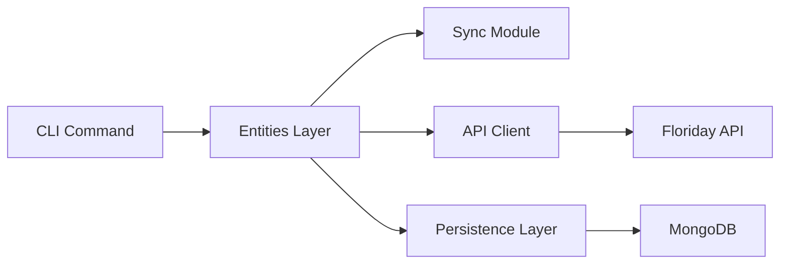

# Doing

## Goal

Add customer orders to the synced entities, following the existing patterns for entity synchronization.

## Analysis

The application currently syncs organizations, trade items, and supply lines using a consistent pattern:

1. Entity sync functions in entities.py
2. CLI commands in sync.py
3. Persistence through MongoDB

We'll follow this pattern to add customer orders synchronization.

## Design

## Steps

After each step, make sure there is a test for any changed functionality and commit our work.

Step 1: Core Entity Sync

- [x] Add tests in tests/test_entities.py for customer offers sync functionality
- [x] Add customer offers section in docs/cli_documentation.md
- [x] Add customer offers sync in src/floridayvine/floriday/entities.py

Step 2: CLI Integration

- [x] Add tests in tests/test_sync.py for CLI command
- [x] Update CHANGELOG.md with new feature
- [x] Add customer_offers command in src/floridayvine/commands/sync.py

Step 3: Integration Testing

- [ ] Add integration test scenarios in tests/manual_testing_plan.md
- [ ] Update software architecture documentation if needed
- [ ] Add test data and verify end-to-end functionality

## Quality Assurance

Before considering this complete:

- [ ] Run make quality for linting and formatting
- [ ] Run make test for unit tests
- [ ] Run integration tests following CONTRIBUTING.md guidelines
- [ ] Manual verification of the sync functionality

## Retrospective

How did this implementation go? Anything we can improve?
If we were to create a guideline for adding another entity to sync, what definitely should be in there?
What can we leave out safely?
What would the outline for such a guide be?
